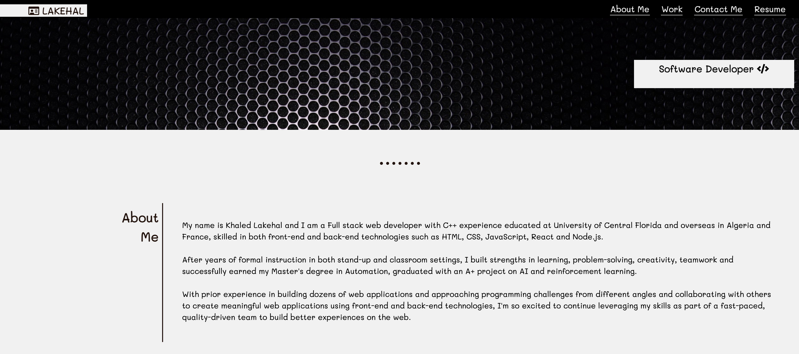

# Portfolio-Website

* Portfolio Page is a place when people can ge an Idea about you, this is a small page that can benifit sales reps or small businesses have a face on the internet that can grow it later on to a more complex website.

* We used  sementic html to build most important containers in the application followed with divs that contain clases to make the job easier and quicker.

* We used flexbox to make the website responsive to all kind of screens we also used media queries to assure that no screen will have an issues seeing the content of the websites.

* The work have been checked using web developer tools with responsive option via multiple phone tablet and computer screen.

the link to the website : http://khaledlakehal.com/

